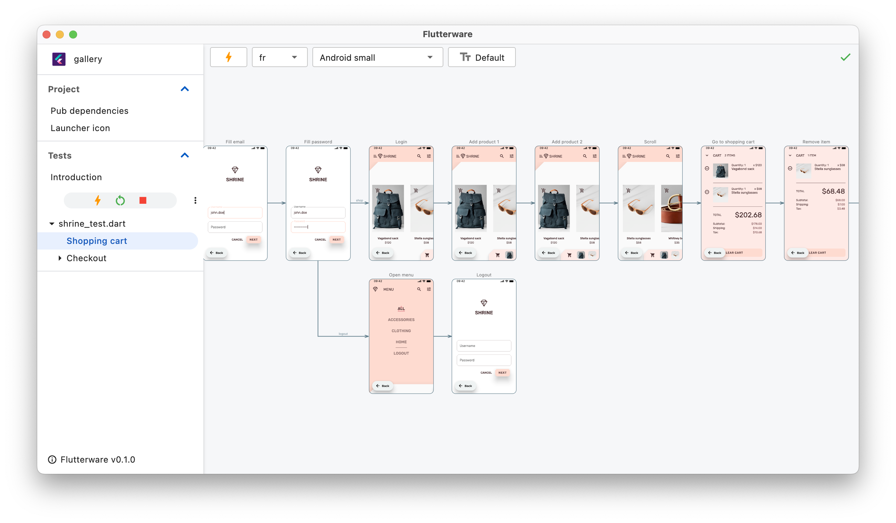
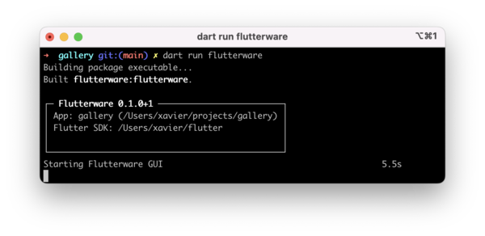

# Flutterware

A collection of GUI tools for Flutter development.



## Quick start

Add `flutterware` package in your `pubspec.yaml`

`dart pub add flutterware`

```yaml
dependencies:
  flutterware:
```

Run the GUI app

```shell
# Run this in your Flutter project directory
dart run flutterware
```
The first launch is a bit slow because the desktop app need to be compiled.



## Features

### Test visualizer

A new kind of testing built on top of the standard `flutter_test` framework.

- Screenshot every step of your test
- Hot-reload a test instantly (~1s) after any change
- Preview your app at any screen size and in all languages
- Easier to write tests that exercise the whole app
- Deploy the tests as a Web page for an internal documentation of the app.

[Example test](doc/app_tests.md)

### Dependency manager

Get an overview of your pub dependencies.

- View Pub & GitHub scores
- Get metric on each packages

### App's icon change

Quickly replace your app's launcher icon.

### More tools to come...

Any contribution is welcome.  
Open GitHub issues and pull requests with your ideas :-)