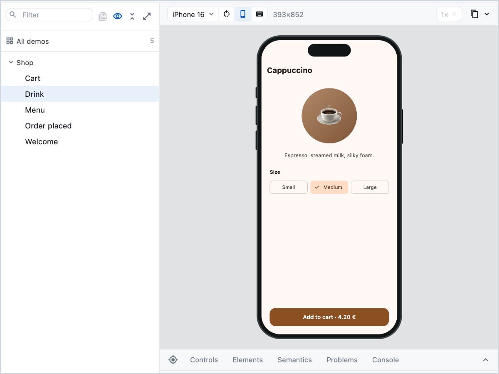
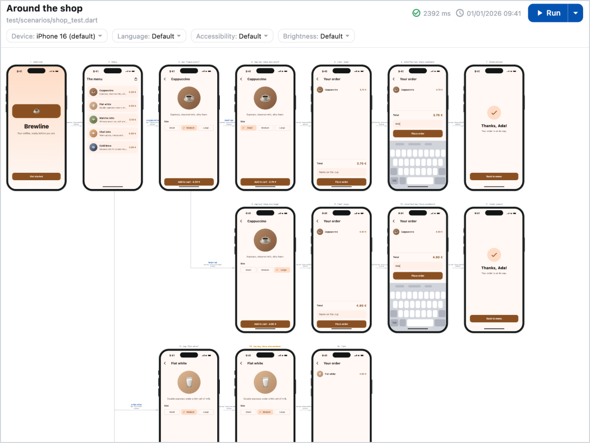
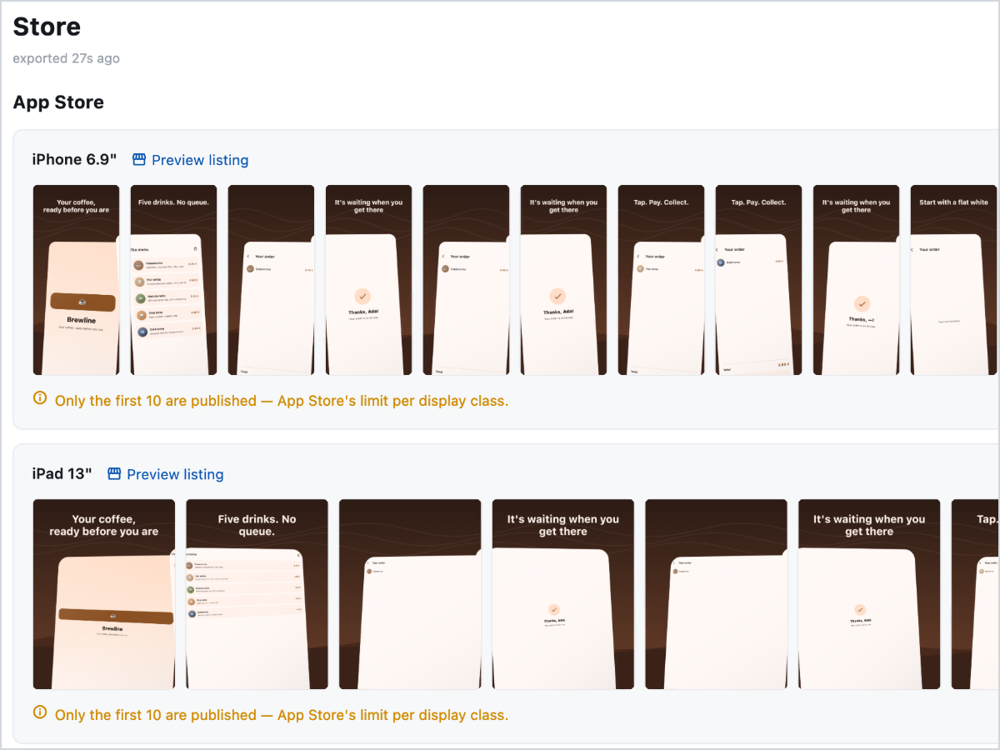
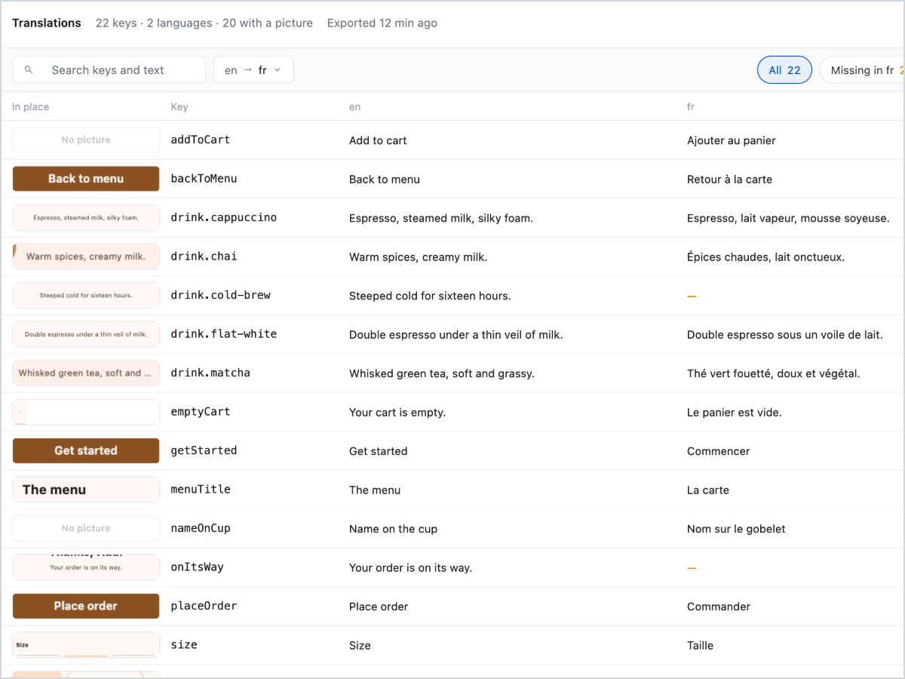

# Flutterware

[](https://pub.dev/packages/flutterware)
[](LICENSE)

A desktop studio for Flutter projects. Preview your widgets on device frames, get
a screenshot of every step of your widget tests, drive the running app, and
export your store screenshots. Every tool also works from the terminal, and
from a coding agent over MCP.

[](https://flutterware.github.io/flutterware/)

## Try it

**In your browser:** [flutterware.github.io/flutterware](https://flutterware.github.io/flutterware/)
is the studio itself, compiled for the web and opened on a recorded demo
project. Nothing to install; it's read-only.

**On your machine:** clone the demo, a small coffee shop app with every tool
turned on, and run it:

```shell
git clone https://github.com/flutterware/flutterware_example
cd flutterware_example
dart run flutterware
```

The first launch builds the studio, so give it a minute. You need Flutter 3.47 or
newer. Live previews are macOS only for now; the rest also runs on Linux and
Windows.

## What's in it

| [Previews](doc/previews.md) | [Scenarios](doc/scenarios.md) |
|:---|:---|
|  |  |
| Your `@Preview` widgets on a device frame, running live. Switch devices, turn knobs, inspect the widget tree. | Widget tests that save a screenshot at every step. The studio draws each run as a flow, per device and per language. |
| **[Store screenshots](doc/store_screenshots.md)** | **[Translations](doc/translations.md)** |
|  |  |
| Store images made from your scenarios, for every locale and screen size. The frame around them is a Flutter widget you write. | Every key in every language, with a picture of where each string appears on screen. Flags missing and too-long strings. |

### Scenarios are widget tests

```dart
scenario('Around the shop', (s) async {
  await s.pumpWidget(const ShopApp());
  await s.tap(ShopKeys.getStarted);
  await s.split({
    'a cold brew': () async {
      await s.tap('Cold brew');
      await s.tap(ShopKeys.addToCart);
      await s.tap(ShopKeys.placeOrder);
    },
    'the empty cart': () async {
      await s.tap(ShopKeys.openCart);
    },
  });
});
```

`flutter test` runs this like any other test. Each step waits for the screen to
settle, then records a screenshot, the widget tree and the visible text.
`s.split` replays the body once per branch, so one scenario covers every path
through a screen. Store screenshots, translation pictures and branch comparisons
are all built from these runs.

### Your agent gets the same tools

The first launch registers an MCP server in your project's `.mcp.json`. With it,
an agent can render a preview to check a layout, run your scenarios and read
what each screen showed, or launch the app on a simulator and tap through it.

Everything is on the command line too:

```shell
alias fw='dart run flutterware'

fw run previews screenshot --entry='demo/shop.dart#shopMenu'
fw run scenarios run
fw run store export
```

### And the rest

| | |
|:---|:---|
| **[Run](doc/run.md)** | Launch the app on any device and see its logs, network calls, widget tree and permissions. Tap and type into it from `fw` or an agent. |
| **[Comparison](doc/comparison.md)** | `fw compare` renders your previews and replays your scenarios on a base branch, then shows what changed. Exports a page you can link from a pull request. |
| **[Dependencies](doc/dependencies.md)** | Every package, the version pub picked, and which constraint asked for it. |
| **[Assets](doc/assets.md)** | What ends up in the bundle, how much it weighs, and which densities are missing. |
| **[Lints](doc/lints.md)** | Every rule your SDK knows about, and whether your `analysis_options.yaml` uses it. |
| **[Splash](doc/native_splash.md) and [icon](doc/launcher_icon.md)** | What each platform will show at launch, read from the generated files. |
| **[Server](doc/server_inspection.md)** | Requests to your Dart server as they happen, the SQL each one ran, and N+1 warnings. |
| **[Dev stack](doc/dev_stack.md)** | Start and stop the processes your project needs while you work. |
| **[Scenes](doc/scenes.md)** | Animations drawn with your own widgets and theme, exported to video. |
| **[Renders](doc/renders.md)** | A widget as SVG, PNG or PDF, from a script or from a server. |
| **[Changes](doc/changes.md)** | What your branch changed, with the files you care about listed first. |

Each tool has a guide in [doc/](doc/README.md), and every action and option is
listed in the [capabilities reference](docs/capabilities.md).

## Add it to your project

```shell
dart pub add flutterware
dart run flutterware
```

Flutterware runs on the Dart SDK you start it with (`fvm dart run flutterware`
works too) and never installs one of its own. The first launch creates
`tool/flutterware.dart`, where you pick your tools:

```dart
import 'package:flutterware/plugins.dart';

const app = Pkg('.');

void main() => Flutterware.configure((fw) {
  fw.use(Previews(packages: [.new(app)]));
  fw.use(Scenarios(packages: [.new(app, languages: ['en', 'fr'])]));
  fw.use(Dependencies(packages: [.new(app)]));
  fw.use(Assets(packages: [.new(app)]));
});
```

It's a plain Dart file, so the analyzer checks it and your editor completes it.
For a monorepo, declare one `Pkg` per package and give each tool the ones it
applies to. The [demo's config](examples/brewline/tool/flutterware.dart) turns
on every tool for one app; [this repo's](tool/flutterware.dart) covers a
three-package workspace.

## Libraries

The package also ships libraries your app and tests can import. They work
without the studio.

| Library | What it's for |
|:---|:---|
| `flutter_test.dart` | Everything in `package:flutter_test`, plus the scenario API. Swap the import and existing tests still compile. See [doc/scenarios.md](doc/scenarios.md). |
| `previews.dart` | `PreviewShell` for theme or locale switches in the previews toolbar, and `context.knobs` for knobs. |
| `devbar.dart` | A developer overlay inside your app: logs, network, feature flags, device frames. |
| `feature_flag.dart` | Feature flags you can read and override at runtime. |
| `router_outlet.dart` | Nested routing driven by the URL. |
| `server.dart` | Hooks for the server inspector, for Dart backends. |
| `ui_catalog.dart` | Builds a browsable web page of your previews. |
| `plugins.dart` | What `tool/flutterware.dart` is written against. |

## Contributing

Issues and pull requests are welcome. [CONTRIBUTING.md](CONTRIBUTING.md) covers
the basics and [CLAUDE.md](CLAUDE.md) explains how the repository is laid out.

The screenshots in this file are generated by flutterware itself, from the demo:

```sh
fvm dart tool/screenshots.dart
```
