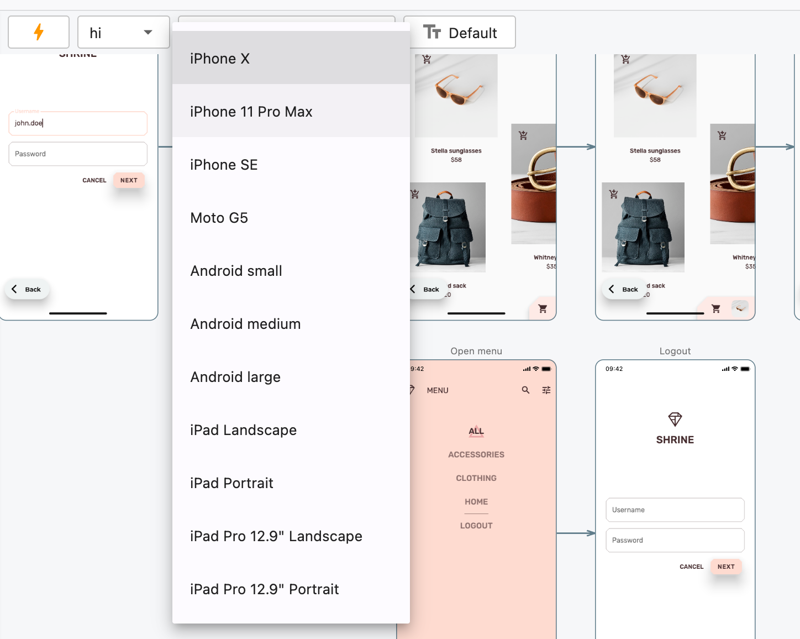

## App test



### Write a test

#### Raw `flutter_test` API

```dart
import 'package:flutterware/flutter_test.dart';

void main() {
  testWidgets('Checkout flow', (tester) async {
    await tester.pumpWidget(MyApp());
    await tester.screenshot(name: 'Home page');
    
    await tester.tap(find.byIcon(Icons.shopping_cart));
    await tester.screenshot(name: 'Cart');

    await tester.enterText(find.byType(TextField), '4334');
    await tester.screenshot(name: 'Enter coupon code');

    await tester.tap(find.text(translations.checkoutButton));
    await tester.screenshot();
  });
}
```

#### High level API (recommended)

```dart
import 'package:flutterware/flutter_test.dart';

void main() {
  testWidgets('Checkout flow', CheckoutTest());
}

class CheckoutTest extends AppTest {
  @override
  Future<void> run() async {
    await pumpWidget(MyApp());
    await screenshot(name: 'Home page');

    await tap(find.byIcon(Icons.shopping_cart));
    await screenshot(name: 'Cart');

    await enterText(TextField, '4334');
    await screenshot(name: 'Enter coupon code');

    await tap(translations.checkoutButton);
    await screenshot();
  }
}
```


